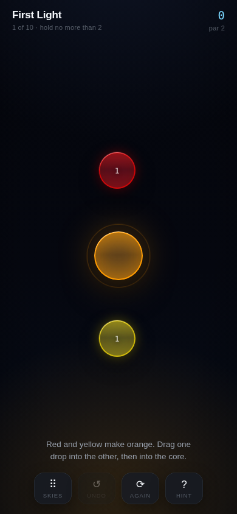
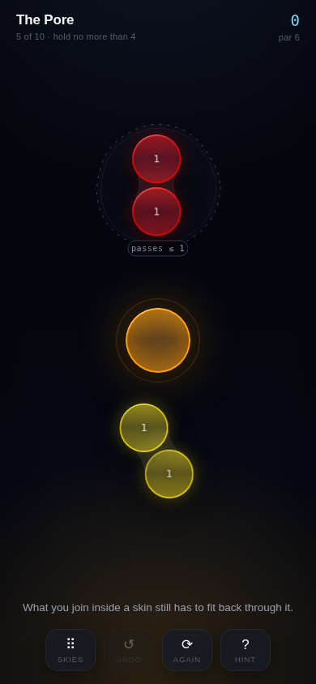
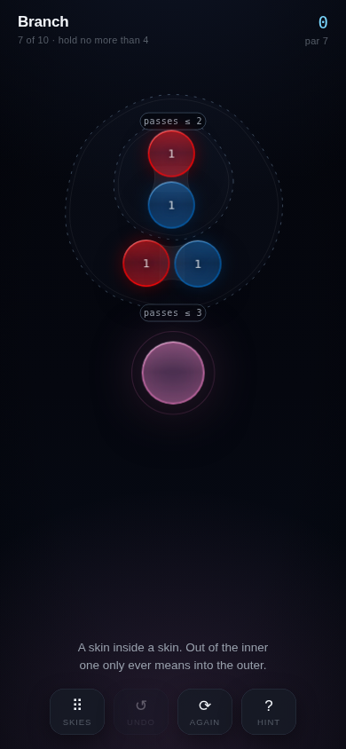
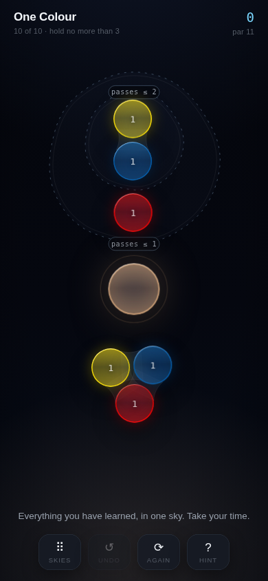
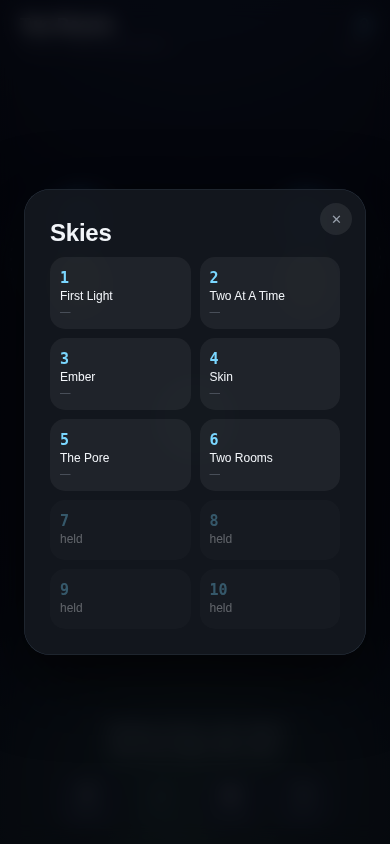

# Blend

A sky full of coloured drops, and one core in the middle of it. Join every drop to the core until
the sky is one colour.

The home page **is** the game — no menu to get through, no splash to sit behind. It opens in the sky
it left you in.

<p>
  
  
  
</p>

## How it plays

Drag one drop into another and they blend: colours mix like paint, and the masses add up. Drag a
drop into the core and it goes home — but only if it is *exactly* the core's colour. Three rules
make that a puzzle rather than a chore:

| | |
| --- | --- |
| **Blending is weighted** | Two parts red to one of yellow is not the same orange as one to one. Size is half the problem. |
| **A drop can only hold so much** | Every sky has a limit. Past it, the skin would burst, and the merge is refused — so the drops have to be grouped, not just poured together. |
| **Some drops are held** | A membrane lets nothing in, and only lets a drop out if it is small enough to fit the pore. Membranes nest, so a deep sky is several small problems in a fixed order. |

Nothing is ever lost: undo goes back a move, and when a sky has no way home left it says so rather
than letting you play on into a wall. The hint is a real one — it is the next move on a genuinely
shortest line, found by the same solver that proves the levels are winnable in the first place.

<p>
  
  
</p>

## Where it came from

The drops, the glass they are made of, the waists they draw between each other as they come into
reach, and the rings the world sends out when you touch it are all carried over from
[Brainstorm](https://github.com/keeterly/brainstorm)'s sky — the same geometry files, the same
imperfection (nothing here is a true circle), the same materials. The membranes are that app's
**group and branch** mechanism turned into barriers: a group is a skin, a branch is a skin inside a
skin, and the pore is what a group will let out of itself.

## The shape of the code

Everything the game *is* lives in four small files that never mention a pixel:

| File | What |
| --- | --- |
| `src/game/color.ts` | Colour in RYB, so blue and yellow make green. A blend is the mass-weighted mean and nothing else — which makes it order-independent, and makes the puzzle plannable. |
| `src/game/rules.ts` | Three moves, four refusals, one immutable state. Undo is the previous value. |
| `src/game/levels.ts` | Ten skies, written as recipes. |
| `src/game/solve.ts` | Plays the real game breadth-first. Proves levels winnable, computes par, powers the hint and the "no way home" warning. |

Everything else — `src/play/` — is the picture. It can never change the game; a gesture it
understands ends in one of those three moves being offered upward, and it draws whatever comes back.

## Running it

```bash
npm install
npm run dev        # http://localhost:5174
npm test           # rules, colour, levels, layout — 73 tests
npm run build      # typecheck + production build to dist/
```

Two more, which need a build being served (`npm run build && npm run preview`):

```bash
npm run shots      # photograph the game at phone size, into shots/
node tools/play.mjs  # play it with a real thumb in a real browser, and fail loudly
node tools/icons.mjs # redraw the app icons out of the game's own materials
```

### Tests worth knowing about

- **Every level balances, is winnable, and its par is real.** The whole sky's mass-weighted mean has
  to equal the core's colour, the solver has to find a line, that line is replayed through the rules,
  and par is what it found. No hand-written par can drift.
- **No level has a spare drop.** Remove any one and it becomes unwinnable — so nothing in a sky is
  decoration.
- **Layout is finite on four sizes of glass.** A NaN radius does not throw; it silently piles every
  drop in the top-left corner and draws no skins at all. That bug happened, once.

## Installing it

It ships a web manifest and the icons, so on a phone "Add to Home Screen" gives it its own icon, no
browser chrome, and the whole screen. It is a static site — `dist/` on any host will do.
